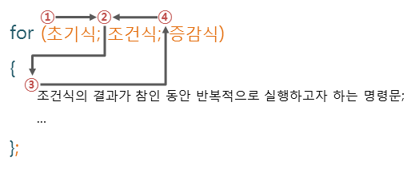
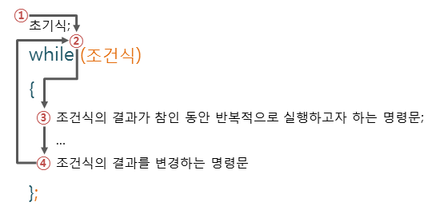

# 반복문
```
for문은 정확히 몇번 회전해야하는지 범위를 알 때 사용함
```




***

 # while문
 ```
while은 주로 정확한 범위가 아닌 상태에 따른 반복일때 사용된다
 아래 사진 참고
 ```


***
# array.lengthㅐㅔㅣ;;
```
length란 모든 배열이 가지고있는 기본 속성이다. 배열의 길이값을 반환해준다(배열의 아이템 개수). 그래서 여러분들이 for문을 이용해서 배열을 검사할때. 배열의 아이템을 일일이 세서 쓸필요없이 for(let i=0;i<array.length;i++) 를 하게되면 알아서 배열의 시작부터 끝까지 돌게된다

```

배열함수 리스트
```

forEach : 반환값이 없다, 단순 for문과 같이 작동한다.
map : 반환값을 배열에 담아 반환한다.
filter: 조건에 충족하는(true) 아이템만 배열에 담아 반환한다.
some: 조건에 충족하는 아이템이 하나라도 있으면 true 반환, 아니면 flase.
every: 모든 배열에 아이템이 조건을 충족하면 true 반환, 아니면 false.
find : 조건에 충족하는 아이템 하나만 반환(여러개라면 첫번째것만 반환)
findIndex : 조건에 충족하는 아이템의 인덱스값 반환 (여러개라면 첫번째아이템의 인덱스

```

