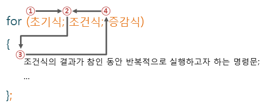
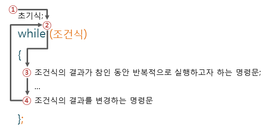

# 반복문
```
for문은 정확히 몇번 회전해야하는지 범위를 알 때 사용함
```




***

 # while문
 ```
while은 주로 정확한 범위가 아닌 상태에 따른 반복일때 사용된다
 아래 사진 참고
 ```


***
# array.length📏
```
length란 모든 배열이 가지고있는 기본 속성이다. 배열의 길이값을 반환해준다(배열의 아이템 개수). 그래서 여러분들이 for문을 이용해서 배열을 검사할때. 배열의 아이템을 일일이 세서 쓸필요없이 for(let i=0;i<array.length;i++) 를 하게되면 알아서 배열의 시작부터 끝까지 돌게된다

```